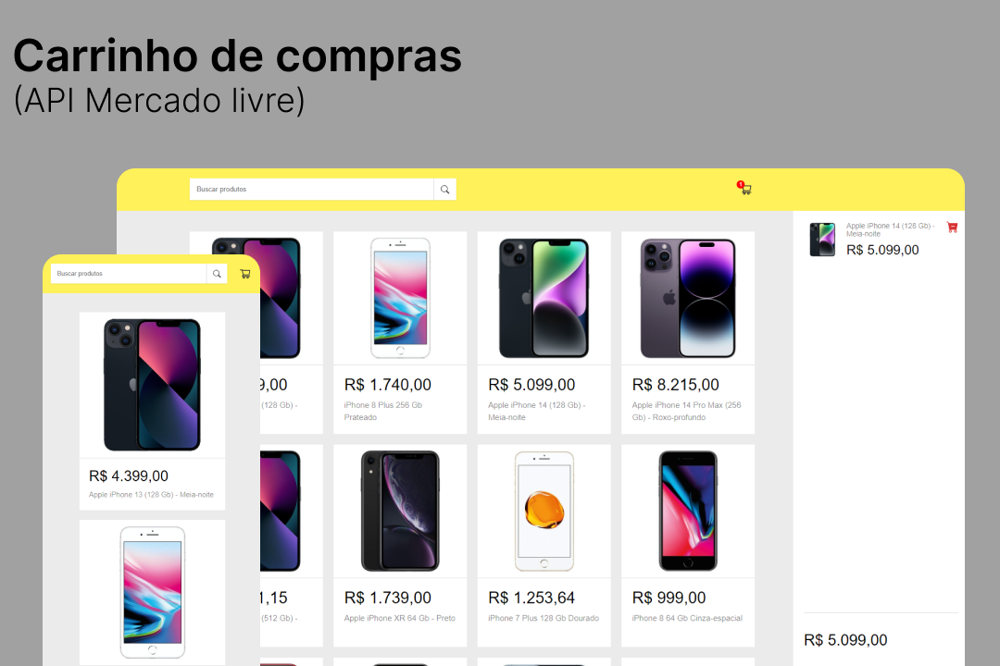

<h1 align="center"> Carrinho de compras feito com ReactJS </h1>

  

# 🚀 TECNOLOGIAS 

- ReactJS : biblioteca JavaScript reponsavel pela criação da interface de usuário.
- Html5 : Linguagem de marcação usada para estruturar os elementos na tela.
- CSS3 : Linguagem de estilos utilizada para estilização dos componentes em tela.
- API do Mercado livre : Utilizada para resgatar informações dos produtos.

# 💻 Projeto 

Carrinho de compras feito com ReactJS, nesse projeto você é capaz de navegar atrás de diversos produtos  adquiridos pela API do mercado livre, o carrinho de compras é totalmente dinâmico podendo ser adicionados e retirados produtos a vontade e de diversas categorias, além de ser exibido o preço total da compra logo abaixo.

